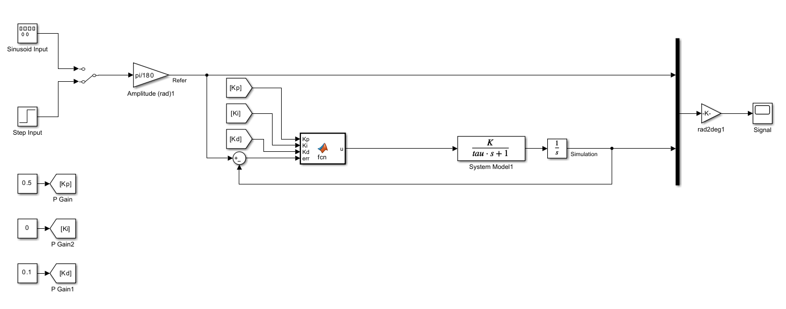
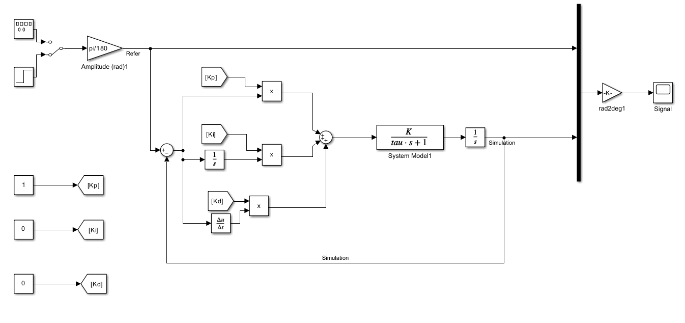
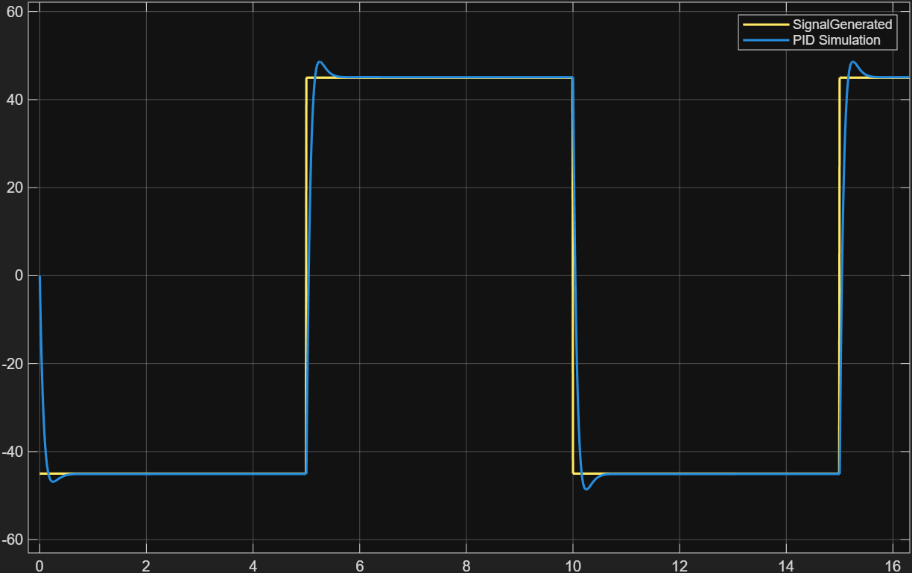
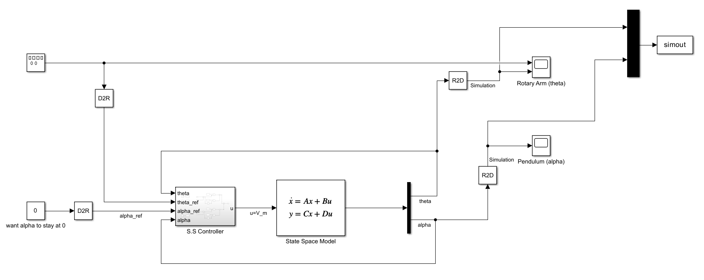
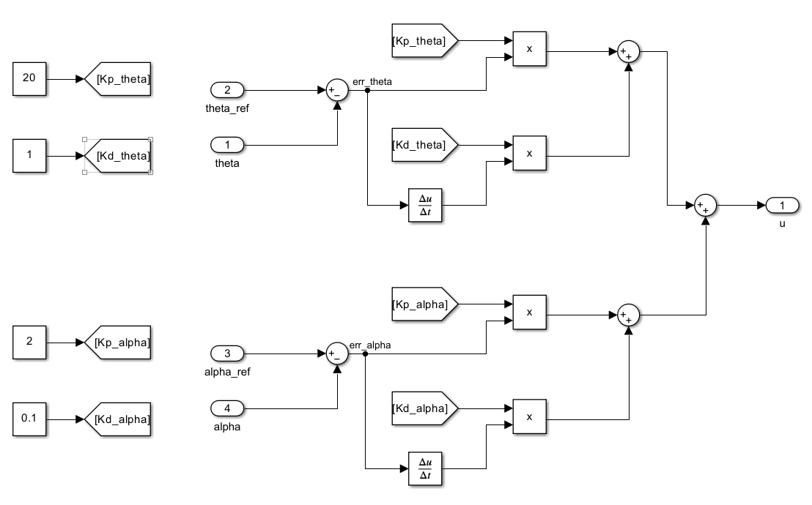
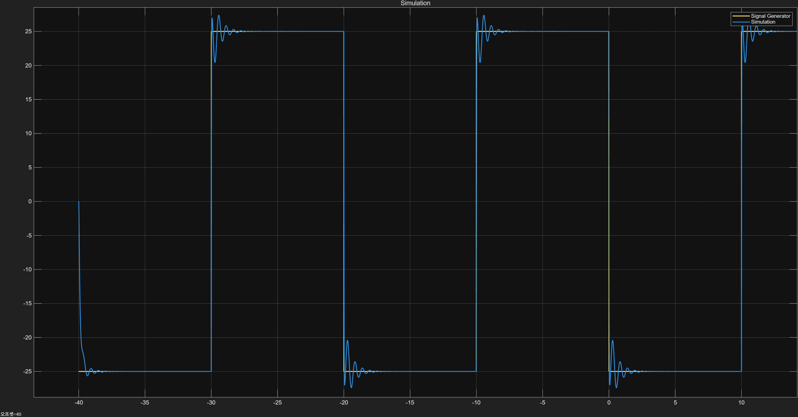

## Motor-Pendulum-Control

MATLAB/Simulink 기반 DC 모터 위치 제어와 Rotary Inverted Pendulum 제어 실습용 저장소입니다.  

---
## 0. Project 구조

```text
Motor-Pendulum-Control/
├── docs/                         # Figures and reference materials
│   ├── DCmotor_pid_simulink.png
│   ├── DCmotor_PID_withoutFunction.png
│   ├── RotaryPendulum_simulink.png
│   └── RotaryPendulum_StateSpaceController.png
├── matlab/
│   ├── models/                   # Simulink models
│   │   ├── DCmotor_PID.slx
│   │   ├── InvertedPendulum_simonly.slx
│   │   └── MotorPD_simonly.slx
│   ├── scripts/                  # MATLAB parameter / setup scripts
│   │   ├── init_dc_motor.m
│   │   └── init_rotary_pendulum.m
│   └── results/                  # Simulation result plots
│       ├── DC_PID_Final.png
│       ├── DC_P_Control/
│       │   ├── Kp_0point1.png
│       │   ├── Kp_1point0.png
│       │   └── Kp_negative.png
│       ├── DC_PI_Control/
│       │   ├── BigKi.png
│       │   ├── SmallKi.png
│       │   └── unstableKi.png
│       ├── DC_PD_Control/
│       │   ├── case1.png
│       │   ├── case2.png
│       │   ├── case3.png
│       │   └── case4.png
│       └── RotaryPendulum/
│           ├── alpha_result.png
│           └── theta_result.png
├── .gitignore
└── README.md
```

---

## 1. DC 모터 위치 제어 (P/PI/PD/PID)

- 모델 파일: `matlab/models/DCmotor_PID.slx`, `matlab/models/MotorPD_simonly.slx`
- 파라미터 스크립트: `matlab/scripts/init_dc_motor.m`

### System model

`init_dc_motor.m`에서 사용한 파라미터 $K$, $\tau$를 이용하면,  
입력 전압 $u(t)$ → 모터 각속도 $\omega(t)$에 대한 1차 시스템은

$$
\tau \frac{d\omega(t)}{dt} + \omega(t) = K\,u(t)
$$

$$
\frac{\Omega(s)}{U(s)} = \frac{K}{\tau s + 1}
$$

출력을 모터 위치 $\theta(t)$로 잡으면 적분기가 한 번 더 붙어

$$
\frac{\Theta(s)}{U(s)} = \frac{K}{s(\tau s + 1)}
$$

### Simulink 모델



필요에 따라 함수 블록을 사용하지 않은 모델도 함께 포함되어 있습니다.



### 대표 결과 (PID 제어)

`matlab/results` 아래에 P/PI/PD/PID 제어 결과가 정리되어 있으며,  
아래 그림은 PID 제어의 최종 응답 예시입니다.



세부 케이스:
- `matlab/results/DC_P_Control` – 비례 이득($K_p$) 변화에 따른 응답
- `matlab/results/DC_PI_Control` – 적분 이득($K_i$) 변화 및 불안정 케이스
- `matlab/results/DC_PD_Control` – 여러 PD 파라미터 케이스

---

## 2. Rotary Inverted Pendulum 제어

- 모델 파일: `matlab/models/InvertedPendulum_simonly.slx`
- 파라미터 스크립트: `matlab/scripts/init_rotary_pendulum.m`

### System model

`init_rotary_pendulum.m`에서 정의한 선형 모델은  
상태 $x = [\theta,\ \dot\theta,\ \alpha,\ \dot\alpha]^\mathsf{T}$,  
입력 $u = V_m$, 출력 $y = [\theta,\ \alpha]^\mathsf{T}$에 대해

$$
\dot{x} = A x + B u,\qquad y = C x + D u
$$

편의 파라미터는

$$
J_\mathrm{eq} = m_p L_r^2 + J_r,\qquad
J_{p,\mathrm{eq}} = J_p + \tfrac{1}{4} m_p L_p^2,\qquad
c = \tfrac{1}{2} m_p L_p L_r,
$$

$$
a = \frac{k_m^2}{R_m} + D_r,\qquad
b = \frac{k_m}{R_m},\qquad
d = \tfrac{1}{2} m_p L_p g,
$$

$$
\Delta = J_\mathrm{eq} J_{p,\mathrm{eq}} - c^2
$$

상태공간 행렬은

$$
A =
\begin{bmatrix}
0 & 1 & 0 & 0 \\
0 & -\dfrac{J_{p,\mathrm{eq}} a}{\Delta} & \dfrac{d c}{\Delta} & \dfrac{D_p c}{\Delta} \\
0 & 0 & 0 & 1 \\
0 & \dfrac{a c}{\Delta} & -\dfrac{J_\mathrm{eq} d}{\Delta} & -\dfrac{D_p J_\mathrm{eq}}{\Delta}
\end{bmatrix},
$$

$$
B =
\begin{bmatrix}
0 \\
\dfrac{J_{p,\mathrm{eq}} b}{\Delta} \\
0 \\
-\dfrac{b c}{\Delta}
\end{bmatrix},
\quad
C =
\begin{bmatrix}
1 & 0 & 0 & 0 \\
0 & 0 & 1 & 0
\end{bmatrix},
\quad
D =
\begin{bmatrix}
0 \\
0
\end{bmatrix}.
$$

### Simulink 모델 및 제어 구조





### 대표 결과

`matlab/results/RotaryPendulum` 디렉터리에 각도 응답 결과가 저장되어 있습니다.



---

## 사용 방법 (간단 요약)

1. MATLAB 및 Simulink 실행
2. 이 저장소를 MATLAB 현재 폴더로 설정
3. 파라미터 초기화
   - DC 모터: `init_dc_motor.m` 실행
   - Rotary Pendulum: `init_rotary_pendulum.m` 실행
4. 원하는 모델(`.slx`)을 열고 시뮬레이션 실행
5. 시뮬레이션 결과는 `matlab/results` 하위 폴더에 이미지로 저장

---